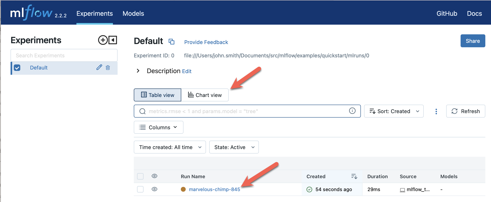
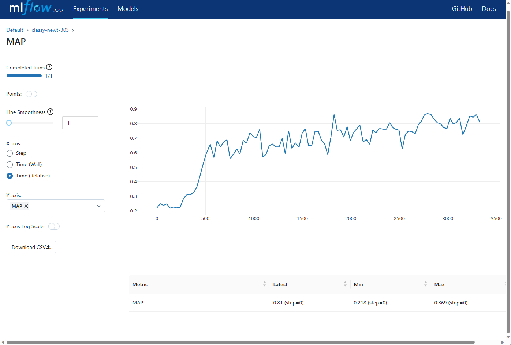
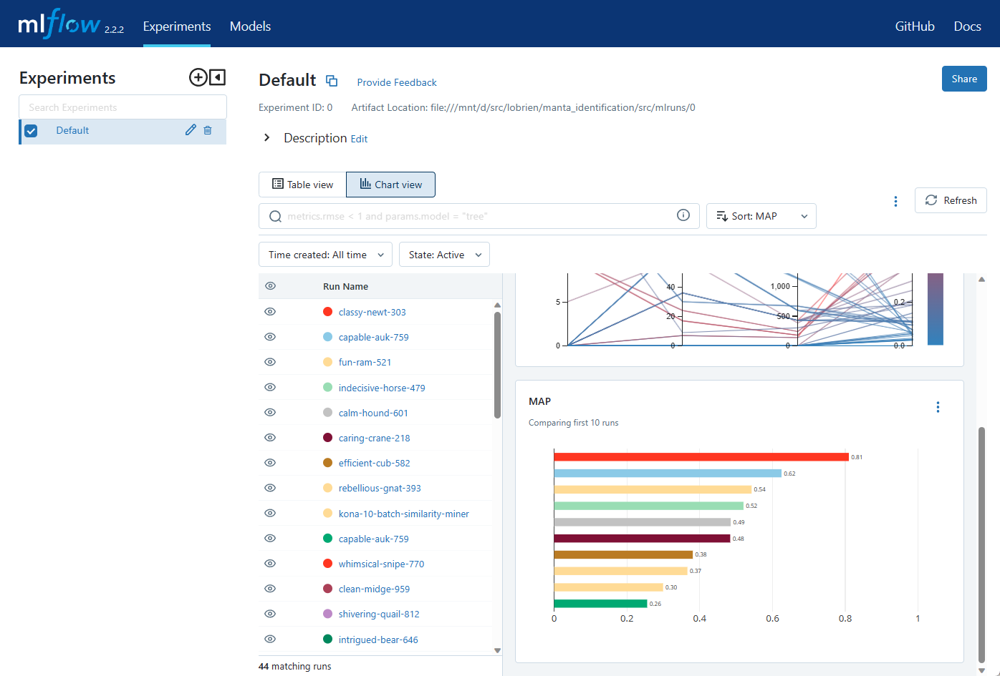

# MLFlow Raspberry Pi 

This repository provides a collection of scripts to assist with setting up and deploying an MLflow environment on a Raspberry Pi 400 running Ubuntu server from MacOS. These scripts install MLflow, train and log a machine learning model, log various parameters, metrics and artifacts to the MLflow tracking server.

MLflow is an open-source platform that helps manage the entire machine learning lifecycle, including experimentation, reproducibility, and deployment. The platform consists of four main components: MLflow Tracking, MLflow Projects, MLflow Models, and MLflow Registry.

MLflow can be used with any machine learning library and requires minimal changes to existing codebases. 

## Structure
`pi_local.sh`: This shell script facilitates the interaction with the Raspberry Pi 400. It begins by checking that the Pi server is running, then installs Homebrew and Rsync on your local machine. It uses Rsync to sync the local directory to the Pi and then remotely runs the Python scripts via SSH.

`ml_autolog.py`: This Python script uses MLflow's autolog feature with a Scikit-learn model. It loads the diabetes dataset from Scikit-learn's built-in datasets, splits it into training and test sets, then trains a RandomForestRegressor on the training data and makes predictions on the test set. The autolog feature automatically logs the model parameters, performance metrics, and the model itself to the MLflow tracking server.

`ml_functions.py`: This Python script demonstrates how to manually log parameters, metrics, and artifacts to MLflow. It starts by setting up the tracking URI for MLflow, then logs a random integer as a parameter, logs another set of random integers as multiple parameters, logs a series of random float values as a metric at different stages, and finally creates a `text.txt` file and logs it as an artifact.

## Prerequisites
* Raspberry Pi 400 running Ubuntu server.
* SSH access to Raspberry Pi.
* The hostname of your Raspberry Pi set to pi.

To start, set the PI_HOST variable to the IP address of your Raspberry Pi and run the pi_local.sh script:

```bash
PI_HOST=$(dig +short pi | tail -n1) bash pi_local.sh
```

This will establish a connection with the Raspberry Pi, synchronize files, install MLflow, and execute the Python scripts to train a machine learning model and log the details to MLflow.

## Using MLFlow
Upon successful execution of the scripts, you can navigate to your MLflow experiment by typing http://pi:5000 in your web browser. 

You are in the Default experiment, which now contains the tracking data for your run. An experiment is a collection of related runs. The MLflow UI opens to the Table view. The main portion of the window shows a table of runs, with each row representing a single run. The columns show the run name, how long ago it was created, its running time, and so forth. If you select a run name, you will open details for the run, which shows the parameters, metrics, and artifacts of the run



You can view the history of a metric by opening Metrics and selecting the metric name. For instance, the following image shows a run’s Mean Average Precision over time.



From the main page, you can switch between Table view and Chart view. Chart view allows you to compare runs at a glance. For instance, the following image shows the Mean Average Precision of the highest-scoring runs in this experiment.



The UI allows you to compare runs, view the code that was executed, and download logged artifacts.

For more detailed instructions and additional features, please refer to the [MLflow documentation](https://www.mlflow.org/docs/latest/index.html).
